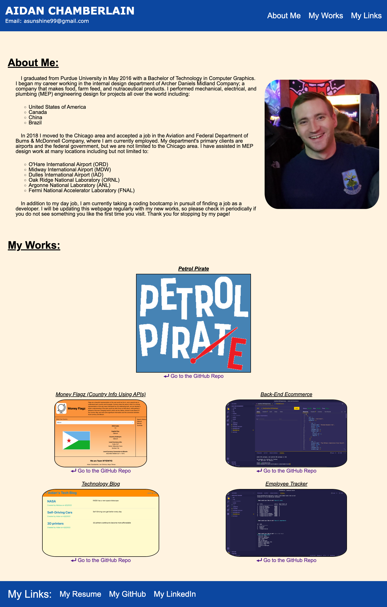

# hw8-portfolio-aidan-chamberlain

## Description

An update to my previous portfolio webpage. I updated the page with my email, links to my Project Money Flagz, as well as links to some of my other homeworks from the bootcamp. I updated the CSS layout of the page to give it better functionality than it had before, and to look better when viewed on a small screen. I updated the information on my GitHub page, my LinkedIn page, and my resume to reflect my current information.

## Screenshot

## Links to Application

-   Here is the repo: [RedComet6/portfolio-aidan-chamberlain](https://github.com/RedComet6/portfolio-aidan-chamberlain)
-   Here is the pages: [RedComet6 portfolio-aidan-chamberlain Pages](https://redcomet6.github.io/portfolio-aidan-chamberlain)
